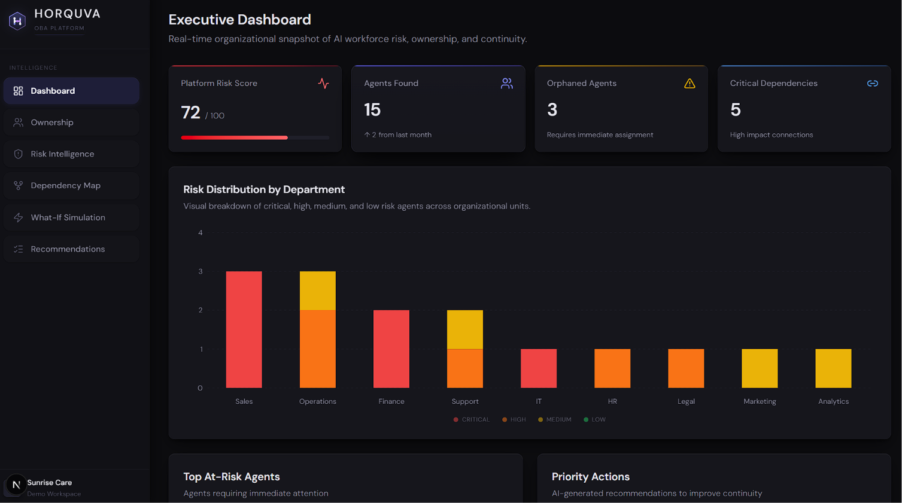
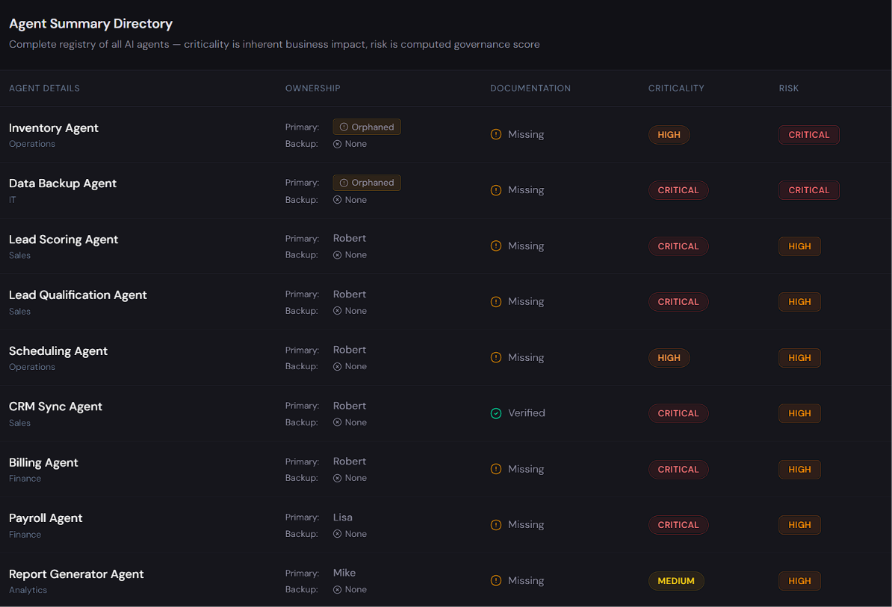
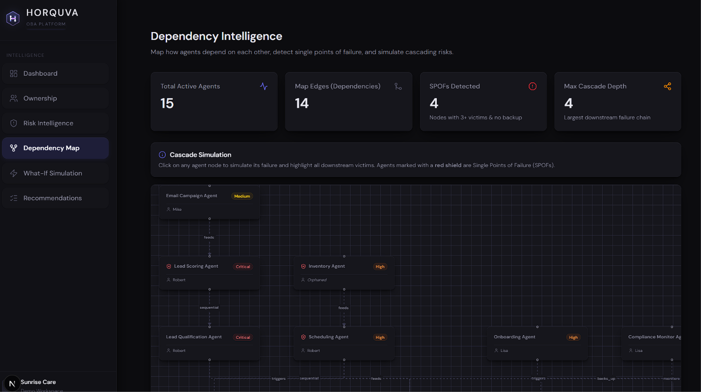
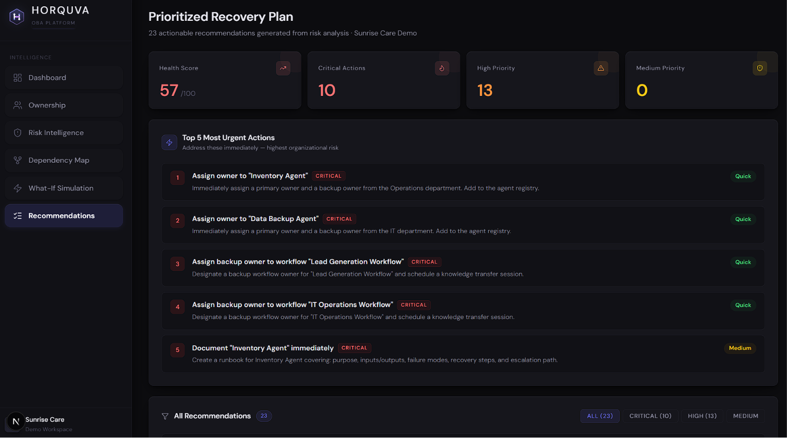
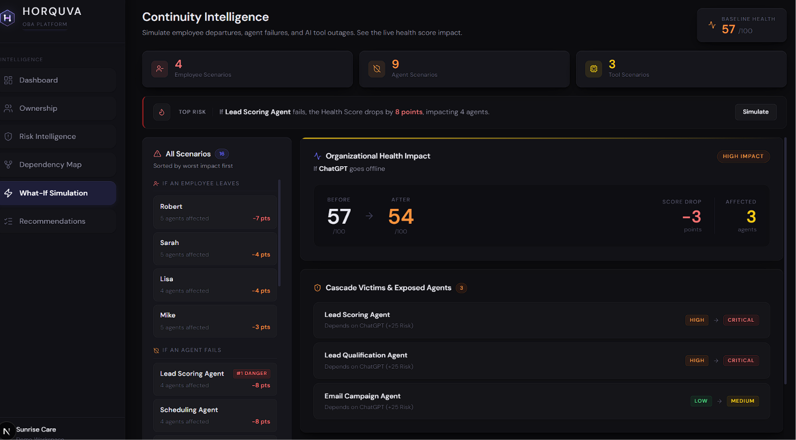
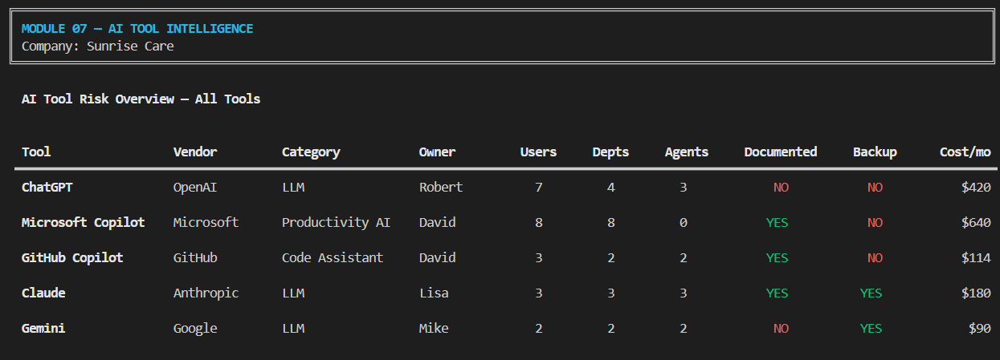
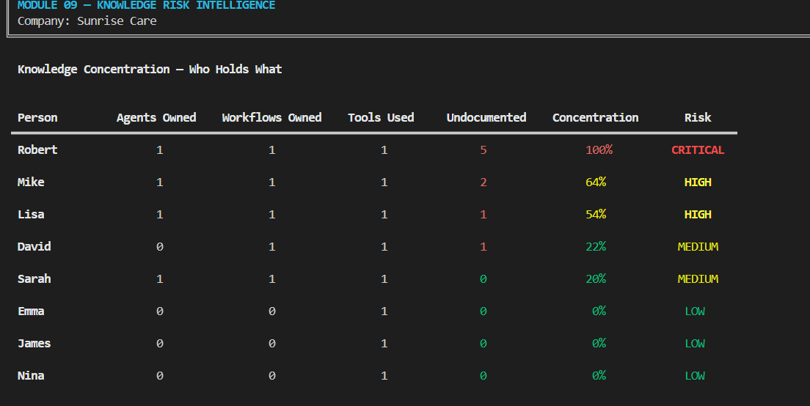
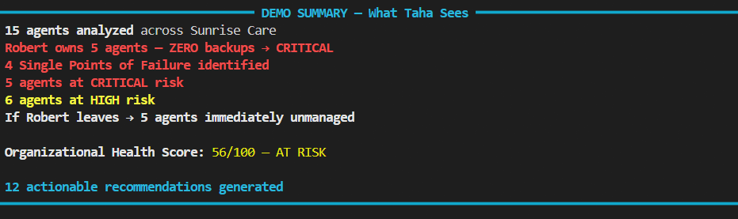

# OBA Core — AI Workforce Intelligence
**Horquva | MVP Demo — Sunrise Care (Fictional Company)**

OBA (Organizational Brain Analysis) is the intelligence engine that discovers, maps, and analyzes AI agents inside an organization — finding who owns them, how 
they connect, what breaks if something goes wrong, and exactly what to do about it.


> 
**"The only thing that matters: This is actually useful."** — Horquva

---

## The Problem

Modern organizations are deploying AI agents faster than they can manage them. Nobody knows:
- Who owns which agent?
- What breaks if one agent fails?
- How severe is the risk if a key person leaves?

OBA Core answers all of this — automatically.

---

## Modules Implemented

### Module 01 — Ownership Intelligence


Analyzes every AI agent to determine ownership status and risk.

**What it does:**
- Identifies the owner and backup owner of each agent
- Detects orphaned agents (no owner assigned)
- Flags owner concentration risk (one person owning too many agents)
- Calculates a risk level per agent: `LOW / MEDIUM / HIGH / CRITICAL`

**Risk scoring factors:**
- No owner → +40 points
- No backup owner → +30 points
- Not documented → +15 points
- Agent criticality (critical/high/medium/low) → up to +15 points

**Key findings on Sunrise Care demo:**
- Robert owns 5 agents with zero backups — highest single-owner risk
- 2 agents fully orphaned: Inventory Agent, Data Backup Agent
- 9 of 15 agents have no backup owner

---

### Module 02 — Dependency Intelligence


Maps how agents depend on each other and simulates cascade failures.

**What it does:**
- Builds a full dependency graph (who feeds into whom)
- Detects Single Points of Failure (SPOF)
- Simulates cascade failures: if Agent X fails, which agents break?
- Shows upstream depth (how deep in a chain an agent sits)

**Key findings on Sunrise Care demo:**
- 4 Single Points of Failure identified
- 6 agents have 3+ downstream cascade victims
- If Onboarding Agent fails → 4 agents break
- If Inventory Agent fails → 4 agents break

---

### Module 03 — Risk Intelligence


Fuses ownership risk and dependency risk into one final risk score per agent and computes an overall Organizational Health Score.

**What it does:**
- Combines Module 01 + Module 02 outputs into a single risk score per agent
- Applies risk tiers: `LOW / MEDIUM / HIGH / CRITICAL`
- CRITICAL rule: orphaned agent OR (SPOF + no backup owner)
- Calculates Organizational Health Score (0–100, lower = more dangerous)
- Shows detailed risk breakdown for every CRITICAL agent

**Key findings on Sunrise Care demo:**
- 5 agents at CRITICAL risk
- 6 agents at HIGH risk
- Organizational Health Score: **56/100 — AT RISK**

---

### Module 04 — Recommendation Engine


Generates specific, prioritized, actionable recommendations based on the risk analysis.

**What it does:**
- Reads Module 03 risk output for every agent
- Generates targeted actions for every CRITICAL and HIGH risk agent
- Prioritizes recommendations: CRITICAL first, then HIGH, then MEDIUM
- Produces a Top 5 Most Urgent Actions list
- Ends with a complete Demo Summary for stakeholder presentation

**Key findings on Sunrise Care demo:**
- 12 actionable recommendations generated
- Top priority: assign owners to orphaned agents immediately
- Redistribute Robert's 5 agents to eliminate single-owner dependency
- Organizational Health Score: 56/100 — recovery plan provided

---

### Module 05 — What-If Simulation Engine


Simulates "what if" scenarios and shows exactly how the Organizational Health Score changes if a person leaves or an agent fails.

**What it does:**
- Simulates every owner leaving the organization one by one
- Simulates every CRITICAL/HIGH/SPOF agent failing
- Recalculates Health Score in real time for each scenario
- Shows before → after risk level per affected agent
- Sorts all scenarios by worst impact first
- Identifies the single most dangerous scenario for the organization

**How it works:**
- **Person Leaves** → all their agents become orphaned (+35 risk score each), Health Score recalculated
- **Agent Fails** → agent goes to max risk (170), all cascade victims get +30 score, Health Score recalculated

**Key findings on Sunrise Care demo:**
- Worst scenario: **Robert leaves → Health Score drops 56 → 49 (HIGH RISK)**
- 5 agents immediately unmanaged if Robert leaves
- Onboarding Agent or Email Campaign Agent failure → 4 downstream agents disrupted (worst agent scenario: Health Score drops to 47)
- Every scenario ranked so leadership knows exactly where to act first

---

### Module 06 — Human-Agent Dependency Map


Maps every person to the agents they own, identifies human single points of failure, and gives full coverage analysis across the organization.

**What it does:**
- Builds an ownership tree for every person (who owns what, with risk levels)
- Calculates coverage score per person: % of their agents that have a backup owner
- Identifies Human SPOFs: people who own 3+ agents with no backups
- Lists every coverage gap: missing owners, missing backups, or both
- Shows exactly which departments each person is responsible for


**Key findings on Sunrise Care demo:**
- **Robert = Human SPOF** — owns 5 agents, 0% coverage, all CRITICAL/HIGH risk
- Sarah = 100% coverage — all 3 agents have backup owners
- 9 total coverage gaps across the organization
- 2 agents with no owner at all (Inventory Agent, Data Backup Agent)
- 7 agents with no backup owner

---

### Module 07 — AI Tool Intelligence


Maps every AI tool in use across the organization — who owns it, how many users depend on it, which agents and workflows it powers, and what breaks if access is lost.

**What it does:**
.png)
- Scores every AI tool for risk: ChatGPT, Claude, Gemini, Microsoft Copilot, GitHub Copilot
- Identifies tools with no backup/alternative assigned
- Maps tool-to-agent and tool-to-workflow dependencies
- Shows which departments are exposed per tool
- Calculates total monthly AI tool spend
- Detects undocumented tools with no usage policy

**Key findings on Sunrise Care demo:**
- ChatGPT = CRITICAL risk — 7 users, 4 departments, powers 3 agents, undocumented, no backup
- Microsoft Copilot = HIGH risk — 8 users across all 8 departments, no backup alternative
- 3 of 5 tools have no backup assigned
- 2 tools (ChatGPT, Gemini) have no usage policy or runbook
- If ChatGPT access is lost: Lead Generation, Marketing Campaign, and Customer Support workflows all break
- Total monthly AI tool spend: **$1,444**

---

### Module 08 — Workflow Intelligence


Maps every workflow as a full step-by-step chain (Human → Tool → Agent → Outcome), identifies ownership gaps, detects single-node failure points, and scores risk across all workflows.

**What it does:**
- Visualizes every workflow step by step: who does what (human, tool, or agent)
- Scores each workflow for risk based on ownership gaps, undocumented status, and human SPOFs
- Identifies single-node failure points — which one person or tool causes total workflow collapse
- Shows workflow ownership coverage and whether backup owners exist
- Surfaces undocumented workflows with no runbook

**Key findings on Sunrise Care demo:**
- 2 CRITICAL workflows: Lead Generation (Robert, no backup, undocumented) and IT Operations (David, no backup, undocumented)
- All 7 workflows have a single human dependency — no workflow survives if its owner leaves
- 14 single-node failure points identified across all workflows
- If Robert leaves: Lead Generation Workflow collapses — no human executor, no runbook
- If ChatGPT access is lost: Lead Generation, Customer Support, and Marketing Campaign workflows are immediately disrupted
- 3 undocumented workflows: Lead Generation, IT Operations, Analytics Reporting

---

### Module 09 — Knowledge Risk Intelligence


Maps where critical organizational knowledge lives — which people hold it, which assets are undocumented, and exactly what the organization loses if a key person walks out.

**What it does:**
.png)
- Calculates a Knowledge Concentration Score per person (0–100%)
- Identifies people who are sole holders of critical undocumented knowledge
- Lists every undocumented agent, workflow, and AI tool
- Maps exactly which assets disappear if each person leaves
- Surfaces knowledge gaps: assets with no documentation and no backup owner

**Key findings on Sunrise Care demo:**
- Robert = CRITICAL knowledge concentration (100%) — sole owner of 5 agents + 1 workflow, all undocumented
- Mike and Lisa = HIGH concentration risk (64% and 54%)
- 8 agents, 3 workflows, and 2 AI tools are completely undocumented — 13 total undocumented assets
- 15 knowledge gaps identified across the organization
- If Robert leaves: Lead Scoring Agent, Lead Qualification Agent, Scheduling Agent, Billing Agent, CRM Sync Agent, and Lead Generation Workflow are all lost with no recovery path

---

### Module 10 — Organizational Memory Intelligence


Tracks the preservation status of every AI asset in the organization — agents, workflows, and tools — and calculates how much institutional knowledge would survive if key people left.

**What it does:**
- Assigns a memory status to every asset: `PRESERVED / AT RISK / VULNERABLE / LOST`
- Calculates the **Institutional Memory Health Score™** (0–100)
- Identifies critical memory carriers — people who are the sole holders of undocumented assets
- Maps which departments are affected if each person leaves
- Flags assets with no documentation and no backup as LOST

**Memory status breakdown (Sunrise Care demo):**
- PRESERVED: 14 assets (documented + backup exists)
- VULNERABLE: 10 assets (no backup or no documentation)
- AT RISK: 1 asset (Gemini — no backup)
- LOST: 2 assets (Data Backup Agent, Inventory Agent — no owner, no documentation)

**Key findings on Sunrise Care demo:**
- Robert = CRITICAL memory carrier — sole holder of 7 assets (6 undocumented), covering Finance, Operations, Sales, and cross-department systems
- David = HIGH risk — sole carrier of IT Operations Workflow (undocumented) + both IT tools
- Mike = HIGH risk — sole carrier of Report Generator Agent and Analytics Reporting Workflow (both undocumented)
- **Institutional Memory Health Score: 54/100 — AT RISK**

---

## Demo Results



| Metric | Result |
|--------|--------|
| Total Agents Analyzed | 15 |
| CRITICAL Risk Agents | 5 |
| HIGH Risk Agents | 6 |
| Single Points of Failure | 4 |
| Robert's Agents (zero backups) | 5 → CRITICAL |
| If Robert Leaves | Health Score: 56 → 49 (HIGH RISK) |
| Organizational Health Score | 56/100 — AT RISK |
| Institutional Memory Health Score | 54/100 — AT RISK |
| Recommendations Generated | 12 |
| Human Single Points of Failure | 1 (Robert) |
| Total Coverage Gaps | 9 |
| Total Undocumented Assets | 13 |
| Total Knowledge Gaps | 15 |

---

## Dataset

`data/sunrise_care.json` — fictional company (Sunrise Care) with:
- 120 employees
- 15 AI agents across Sales, Finance, HR, Operations, Support, Marketing
- 14 dependency relationships
- 3 primary owners: Robert, Sarah, Lisa
- 2 fully unowned (orphaned) agents
- Designed to stress-test: Robert owns 5 agents, no backups, 3 critical dependencies

---

## How to Run

### Python CLI (Intelligence Engine)

```bash
# Install dependencies
uv sync

# Run all 10 modules
uv run main.py
```

> This project uses [uv](https://github.com/astral-sh/uv) as the package manager.  
> All dependencies are declared in `pyproject.toml` and locked in `uv.lock`.

---

### Backend API (Node.js + Express + Supabase)

```bash
cd backend

# Install dependencies
npm install

# Start the server
node index.js
```

Server starts on **http://localhost:3000**

#### Available Endpoints

| Endpoint | Description |
|----------|-------------|
| `GET /api/agents` | All agents with full details |
| `GET /api/ownership` | Owners with their agents and risk levels |
| `GET /api/dependencies` | Dependency graph with cascade relationships |
| `GET /api/risks` | Risk score breakdown across all agents |
| `GET /api/dashboard` | Summary: total agents, orphans, risk score, critical counts |

#### Environment Setup

Copy `backend/.env.example` to `backend/.env` and fill in your Supabase credentials:

```
SUPABASE_URL=your_supabase_project_url
SUPABASE_KEY=your_supabase_secret_key
PORT=3000
```

> **Note:** `.env` is git-ignored and must never be committed.

---
## Frontend UI

**Stack:** Next.js 16 · TypeScript · Tailwind CSS v4 · Recharts · Lucide Icons
The `frontend/` directory contains the executive-facing dashboard that visualizes OBA Core intelligence for organizational leaders.
### Run the Frontend
```bash
cd frontend
npm install
npm run dev

Runs on http://localhost:3001
```
## Project Structure

```
data/
  sunrise_care.json                     # agent + dependency dataset (Python CLI)

modules/
  __init__.py
  ownership_intelligence.py             # Module 01 — Ownership Analysis
  dependency_intelligence.py            # Module 02 — Dependency Mapping
  risk_intelligence.py                  # Module 03 — Risk Scoring
  recommendation_engine.py              # Module 04 — Action Recommendations
  whatif_simulation.py                  # Module 05 — What-If Simulation Engine
  human_agent_map.py                    # Module 06 — Human-Agent Dependency Map
  ai_tool_intelligence.py               # Module 07 — AI Tool Intelligence
  workflow_intelligence.py              # Module 08 — Workflow Intelligence
  knowledge_risk_intelligence.py        # Module 09 — Knowledge Risk Intelligence
  organizational_memory_intelligence.py # Module 10 — Organizational Memory Intelligence

backend/
  index.js                              # Express server entry point
  supabase.js                           # Supabase client
  package.json                          # Node.js dependencies
  .env.example                          # Environment variable template
  routes/
    agents.js                           # GET /api/agents
    ownership.js                        # GET /api/ownership
    dependencies.js                     # GET /api/dependencies
    risks.js                            # GET /api/risks
    dashboard.js                        # GET /api/dashboard


frontend/
├── app/
│   ├── layout.tsx                # Persistent Shell (Sidebar)
│   ├── globals.css               # Design system, tokens, animations
│   ├── page.tsx                  # Screen 1: Executive Dashboard 
│   ├── ownership/page.tsx        # Screen 2: Ownership Intelligence
│   ├── risk/page.tsx             # Screen 3: Risk Intelligence
│   ├── map/page.tsx              # Screen 4: Dependency Map
│   ├── simulation/page.tsx       # Screen 5: What-If Simulation
│   └── recommendations/page.tsx  # Screen 6: Recommendations
├── components/
│   ├── layout/
│   │   └── Sidebar.tsx           # Navigation sidebar with 6 routes
│   ├── dashboard/                # Module 1
│   │   ├── KpiStrip.tsx          
│   │   ├── Heatmap.tsx           
│   │   ├── RiskSplit.tsx         
│   │   └── AgentTable.tsx        
│   ├── ownership/                # Module 2
│   │   ├── OwnershipOverview.tsx 
│   │   ├── ConcentrationBar.tsx  
│   │   └── OwnershipList.tsx     
│   ├── map/                      # Module 3
│   │   ├── CustomNodes.tsx       
│   │   ├── DependencyKPIs.tsx    
│   │   ├── FlowCanvas.tsx        
│   │   └── DependencyTable.tsx   
│   └── simulation/               # Module 4
│       ├── SimulationDashboard.tsx
│       ├── ScenarioRanking.tsx   
│       └── ImpactSummary.tsx     
│   ├── recommendations/          # Module 5
│       ├── RecommendationHeader.tsx
│       ├── Top5Urgent.tsx
│       ├── RecommendationList.tsx
│       └── DemoSummary.tsx
├── lib/
│   ├── data.ts                   # Server-side JSON loader for sunrise_care.json
│   ├── graph.ts                  # Graph/Cascade logic for Map
│   ├── risk.ts                   # Risk scoring utilities
│   └── simulation.ts             # "What-If" scenario logic
└── types/
    └── index.ts                  # TypeScript definitions
```
Images/
 
 main.py                                 # runs all 10 Python modules in sequence
pyproject.toml                          # Python project dependencies
uv.lock                                 # locked dependency versions
```


---

## Tech Stack

| Layer | What | Tool |
|-------|------|------|
| Intelligence Engine | AI Logic | Python |
| Intelligence Engine | Package Manager | uv |
| Intelligence Engine | Terminal Output | rich |
| Intelligence Engine | Dataset | JSON |
| Backend API | Server | Node.js + Express |
| Backend API | Database | Supabase (PostgreSQL) |
| Backend API | Auth/Client | @supabase/supabase-js |
| Both | Version Control | GitHub |

---

## Module Engineering 

| Module | Module Name | Lead Engineer |
|--------|-------------|---------------|
| **Module 01** | Ownership Intelligence | Huzaifa |
| **Module 02** | Dependency Intelligence | Huzaifa |
| **Module 03** | Risk Intelligence | Huzaifa |
| **Module 04** | Recommendation Engine | Kamran |
| **Module 05** | What-If Simulation Engine | Kamran |
| **Module 06** | Human-Agent Dependency Map | Kamran |
| **Module 07** | AI Tool Intelligence | Huzaifa |
| **Module 08** | Workflow Intelligence | Huzaifa |
| **Module 09** | Knowledge Risk Intelligence | Kamran |
| **Module 10** | Organizational Memory Intelligence | Kamran |
