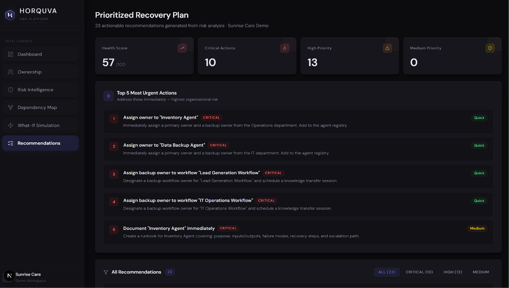
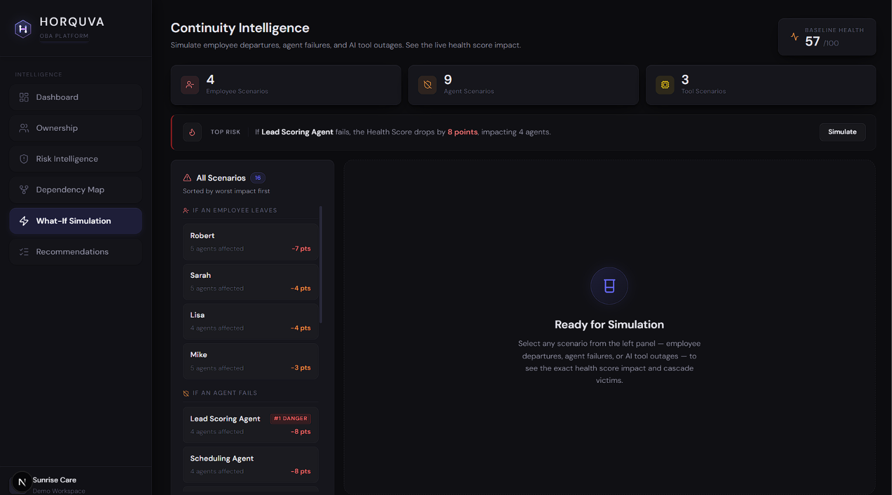

# OBA Core — AI Workforce Intelligence Engine

**Developed by Horquva · MVP Demo · Sunrise Care (Fictional Company)**

OBA Core (Organizational Brain Analysis) is an enterprise-grade intelligence engine that automatically discovers, maps, and analyzes every AI agent operating inside an organization. It answers the three questions no organization can currently answer:

- **Who owns each AI agent?**
- **What breaks — and how badly — if one fails?**
- **What happens to the organization if a key person leaves?**

OBA Core answers all of this in seconds, with full risk scoring, cascade simulation, and prioritized action plans.


<b style="font-size: 16px; font-weight: 800; color: black;">"The only thing that matters: This is actually useful." — Horquva</b>

---

## The Problem We Solve

Organizations are deploying AI agents faster than they can govern them. The result is invisible risk:

- Agents running with no owner, no documentation, no backup
- One person quietly controlling 5+ critical agents — with zero coverage
- Nobody knowing which agent failure cascades into a full department breakdown
- Leadership making decisions with no visibility into their AI infrastructure

**OBA Core makes the invisible visible.**

---

## What Was Built

OBA Core is a full-stack intelligence platform with three layers:

| Layer | Technology | Purpose |
|-------|-----------|---------|
| Intelligence Engine | Python · uv · rich | 12 analytical modules that process org data |
| Backend API | Node.js · Express · Supabase | REST API serving all intelligence data |
| Executive Dashboard | Next.js 16 · TypeScript · Tailwind · Recharts | Interactive visualization for leadership |

---

## Intelligence Modules (12 Total)

### Module 01 — Ownership Intelligence


Analyzes every AI agent across the organization and scores ownership risk.

**What it does:**
- Identifies the primary owner and backup owner for each agent
- Detects fully orphaned agents (no owner assigned whatsoever)
- Flags owner concentration risk — one person controlling too many critical agents
- Calculates a risk level per agent: `LOW / MEDIUM / HIGH / CRITICAL`

**Risk Scoring Formula:**
| Factor | Points Added |
|--------|-------------|
| No owner assigned | +40 |
| No backup owner | +30 |
| Not documented | +15 |
| Agent criticality: critical | +15 |
| Agent criticality: high | +10 |
| Agent criticality: medium | +5 |

**Score -> Risk Tier:** `< 20 = LOW` · `20-39 = MEDIUM` · `40-69 = HIGH` · `70+ = CRITICAL`

**Sunrise Care findings:**
- Robert owns 5 agents — zero backups — highest single-owner concentration in the org
- 2 agents fully orphaned: Inventory Agent, Data Backup Agent
- 9 of 15 agents have no backup owner

---

### Module 02 — Dependency Intelligence


Builds a full dependency graph of all AI agents and maps cascade failure paths.

**What it does:**
- Constructs a directed dependency graph: which agents feed into which
- Detects Single Points of Failure (SPOF) — agents whose failure breaks 3+ downstream agents
- Simulates cascade failure: if Agent X goes down, which agents are affected?
- Calculates upstream depth — how deep in a dependency chain each agent sits

**Sunrise Care findings:**
- 4 Single Points of Failure identified across 15 agents
- 6 agents have 3 or more downstream cascade victims
- Onboarding Agent failure -> 4 agents immediately break
- Inventory Agent failure -> 4 agents immediately break

---

### Module 03 — Risk Intelligence


Fuses ownership risk and dependency data into a single composite risk score per agent, then computes the Organizational Health Score.

**What it does:**
- Combines Module 01 + Module 02 outputs into one unified risk score
- Applies CRITICAL override rule: any orphaned agent OR any SPOF with no backup = CRITICAL regardless of score
- Calculates the **Organizational Health Score (0-100)** — a single number representing how well-governed the organization's AI infrastructure is
- Produces a complete risk breakdown per agent for executive review

**Sunrise Care findings:**
- 5 agents at CRITICAL risk
- 6 agents at HIGH risk
- **Organizational Health Score: 56/100 — AT RISK**

---

### Module 04 — Recommendation Engine


Generates specific, named, prioritized actions based on every risk finding — not generic advice.

**What it does:**
- Reads every risk finding from Module 03 for every agent
- Generates a targeted recommendation per risk: names the agent, names the person, names the exact action
- Prioritizes all recommendations: CRITICAL -> HIGH -> MEDIUM, then Quick wins first
- Produces a Top 5 Most Urgent Actions list for immediate leadership action
- Calculates how each fix improves the Organizational Health Score

**Sunrise Care findings:**
- 12 actionable recommendations generated
- Top priority: immediately assign owners to Inventory Agent and Data Backup Agent
- Redistribute Robert's 5 agents — single departure would orphan all of them
- Recovery plan provided with projected Health Score improvement per action

---

### Module 05 — What-If Simulation Engine


Simulates every possible disruption scenario and calculates its exact impact on organizational health before it happens.

**What it does:**
- Simulates every owner leaving the organization (one by one)
- Simulates every CRITICAL/HIGH/SPOF agent failing
- Recalculates the Organizational Health Score for each scenario in real time
- Shows before -> after risk level for every affected agent
- Ranks all scenarios from most dangerous to least — so leadership knows exactly where fragility lives

**Simulation logic:**
- **Person Leaves** -> their agents lose primary ownership (+35 risk each), Health Score recalculated
- **Agent Fails** -> failed agent reaches maximum risk (score 170), all cascade victims receive +30 risk penalty

**Sunrise Care findings:**
- **Worst scenario: Robert leaves -> Health Score collapses from 56 -> 49**
- 5 agents become immediately unmanaged if Robert is unavailable
- Worst agent scenario: Onboarding Agent failure drops Health Score to 47
- Every scenario ranked so leadership can prioritize risk mitigation investment

---

### Module 06 — Human-Agent Dependency Map


Maps every person in the organization to the agents they control and scores human-level coverage risk.

**What it does:**
- Builds a complete ownership tree per person: which agents they own, at what risk level
- Calculates a coverage score per person: what % of their agents have backup owners
- Identifies Human SPOFs: individuals who own 3+ agents with no backup coverage anywhere
- Lists every coverage gap across the organization with exact agent names


**Sunrise Care findings:**
- **Robert = Human SPOF** — 5 agents owned, 0% coverage, all CRITICAL or HIGH risk
- Sarah = 100% coverage — all 3 of her agents have backup owners
- 9 total coverage gaps identified across the organization
- 7 agents have a primary owner but zero backup coverage

---

### Module 07 — AI Tool Intelligence


Audits every AI tool in use across the organization — usage, risk, dependencies, and financial exposure.

**What it does:**

.png)

- Scores every AI tool for risk: ChatGPT, Claude, Gemini, Microsoft Copilot, GitHub Copilot
- Maps tool-to-agent and tool-to-workflow dependencies: if this tool goes offline, what breaks?
- Identifies tools with no backup/alternative and no usage policy
- Shows department-level exposure per tool
- Calculates total monthly AI tool spend across the organization

**Sunrise Care findings:**
- ChatGPT = CRITICAL — 7 users, 4 departments, powers 3 agents, no policy, no backup
- Microsoft Copilot = HIGH — 8 users across all 8 departments, no backup alternative
- 3 of 5 tools have no fallback option assigned
- If ChatGPT access is revoked: Lead Generation, Marketing Campaign, and Customer Support workflows all break simultaneously
- **Total monthly AI tool spend: $1,444**

---

### Module 08 — Workflow Intelligence


Maps every business workflow step by step — Human -> Tool -> Agent -> Outcome — and scores failure risk at each node.

**What it does:**
- Visualizes every workflow as a full sequential chain with named actors at each step
- Scores each workflow for risk: ownership gaps, undocumented status, human SPOF dependency
- Identifies single-node failure points — the one person or tool whose removal collapses the entire workflow
- Surfaces workflows with no runbook, no backup owner, and no recovery path

**Sunrise Care findings:**
- 2 CRITICAL workflows: Lead Generation (Robert, no backup, undocumented) and IT Operations (David, no backup, undocumented)
- All 7 workflows have exactly one human dependency — no workflow survives its owner leaving
- 14 single-node failure points identified across all workflows
- 3 workflows have zero documentation: Lead Generation, IT Operations, Analytics Reporting

---

### Module 09 — Knowledge Risk Intelligence


Maps where critical organizational knowledge is stored — in people's heads — and calculates what disappears if they leave.

**What it does:**

.png)

- Calculates a Knowledge Concentration Score per person (0-100%)
- Identifies sole knowledge holders: people who are the only ones who know how a critical asset works
- Lists every undocumented agent, workflow, and AI tool across the organization
- Maps exactly which assets are unrecoverable if a specific person leaves today
- Surfaces knowledge gaps: assets with no documentation AND no backup owner

**Sunrise Care findings:**
- Robert = CRITICAL knowledge concentration (100%) — sole owner of 5 agents + 1 workflow, all undocumented
- Mike and Lisa = HIGH concentration risk (64% and 54%)
- 13 total undocumented assets across agents, workflows, and tools
- If Robert leaves today: 6 assets are permanently unrecoverable with no documentation and no backup

---

### Module 10 — Organizational Memory Intelligence


Tracks the institutional memory preservation status of every AI asset and calculates how much organizational knowledge would survive a major personnel disruption.

**What it does:**
- Assigns a memory status to every asset: `PRESERVED / AT RISK / VULNERABLE / LOST`
- Calculates the **Institutional Memory Health Score (0-100)**
- Identifies critical memory carriers — individuals who are the sole holders of undocumented knowledge
- Flags assets classified as LOST: no owner, no documentation, no recovery path

**Memory Status Definitions:**
| Status | Meaning |
|--------|---------|
| PRESERVED | Documented + backup owner exists |
| AT RISK | Has backup but lacks documentation |
| VULNERABLE | Has documentation but no backup owner |
| LOST | No owner, no documentation — unrecoverable |

**Sunrise Care findings:**
- PRESERVED: 14 assets · VULNERABLE: 10 assets · AT RISK: 1 asset · LOST: 2 assets
- Robert = CRITICAL memory carrier — sole holder of 7 assets, 6 of which are undocumented
- David = HIGH risk — sole carrier of IT Operations Workflow + both IT tools, all undocumented
- **Institutional Memory Health Score: 54/100 — AT RISK**

---

## Phase 2 — Platform Foundation

### Intelligence Pipeline

The cross-pillar intelligence layer that connects all data sources into a unified graph.

**What it does:**
- Builds entity cache from agents, tools, workflows, and policies
- Resolves relationships between entities (who owns what, what applies to what)
- Provides filtered views: get entities by type, find uncovered entities, get policies per entity
- Powers both Governance and Accountability intelligence modules

### Data Models

Core data structures for the Governance & Accountability pillar:

- **Entity** — any asset in the organization (agent, tool, workflow, policy, person)
- **GovernancePolicy** — policies that govern entities (domain, status, review cycle, compliance)
- **AccountabilityLink** — RACI-style accountability chain per entity (responsible, accountable, consulted, informed, decision authority)
- **GovernanceGap** — detected governance weaknesses with severity and details
- **PillarResult** — aggregated health metrics per intelligence pillar

### Storage Layer

Persists intelligence analysis results as JSON with metadata timestamps.

**What it does:**
- Saves/loads per-pillar analysis results (governance, accountability)
- Maintains an intelligence index with pillar metadata
- Auto-creates directory structure on first run
- Tracks when each pillar was last updated

### Governance Data Framework

The analytical engine behind governance scoring and gap detection.

**What it does:**
- Scores each entity for governance health (0-100) based on: ownership, documentation, policy coverage, enforcement status
- Builds a governance heatmap across all entities and departments
- Detects governance gaps: no owner, no policy, expired policies, undocumented entities
- Calculates overall governance score for the organization

---

## Phase 3 — Governance & Accountability Pillar

### Module 19 — Governance Intelligence

Answers: **"Who owns what? Is governance working? Where are governance weaknesses?"**

**What it does:**
- Calculates a Governance Score per entity (0-100) based on ownership, documentation, and policy coverage
- Classifies entities into: `HEALTHY / WARNING / AT RISK / CRITICAL`
- Builds a **Governance Heatmap by Department** — average score, entity count, critical gaps
- Performs **Governance Risk Detection** — identifies top issues with severity and remediation steps

**Scoring factors:**
- No owner -> -40 points
- Not documented -> -20 points
- No governance policy -> -25 points
- Expired policy -> -15 points
- No enforced policy on critical entity -> -10 points
- High-criticality entity with zero coverage -> -15 points

**Key findings on Sunrise Care demo:**
- Overall Governance Score: **70/100 — WARNING**
- 3 entities at CRITICAL governance level (Inventory Agent, Data Backup Agent, Lead Generation Workflow)
- 2 entities at AT RISK level
- 13 of 27 entities are undocumented
- IT department has worst governance (avg score 35/100)
- Legal and Marketing departments score best (85+ / 100)

---

### Module 20 — Accountability Intelligence

Answers: **"Who approved this? Who is responsible? Who is accountable?"**

**What it does:**
- Builds an **Accountability Map** for every entity using RACI-style analysis (Responsible, Accountable, Consulted, Informed)
- Scores each entity's accountability structure (0-100)
- Identifies separation-of-duties violations (same person responsible AND accountable)
- Builds **Responsibility Chains** — who carries what burden across the organization
- Maps **Decision Ownership** — who has final authority for each entity

**Scoring factors:**
- No responsible person -> -30 points
- No accountable person -> -25 points
- Same person responsible and accountable -> -10 points
- No consultation defined -> -10 points
- No informed parties -> -5 points
- No decision authority -> -15 points
- Single-person approval chain -> -10 points

**Key findings on Sunrise Care demo:**
- Overall Accountability Score: **76/100 — WARNING**
- 7 entities have the same person as both responsible and accountable (no separation of duties)
- Robert carries the heaviest burden: responsible AND accountable for 5 agents
- No entities have consultation or informed parties defined
- All decision authority is concentrated at the individual owner level

---

## Demo Results Summary


| Metric | Result |
|--------|--------|
| Total Agents Analyzed | 15 |
| CRITICAL Risk Agents | 5 |
| HIGH Risk Agents | 6 |
| Single Points of Failure (Agent) | 4 |
| Human Single Points of Failure | 1 (Robert) |
| Robert's Agents (zero backups) | 5 -> all CRITICAL |
| Worst Scenario: Robert Leaves | Health Score: 56 -> 49 |
| Organizational Health Score | **56/100 — AT RISK** |
| Institutional Memory Health Score | **54/100 — AT RISK** |
| Actionable Recommendations Generated | 12 |
| Total Coverage Gaps | 9 |
| Total Undocumented Assets | 13 |
| Total Knowledge Gaps | 15 |
| Total Monthly AI Tool Spend | $1,444 |
| **Governance Score** | **70/100 — WARNING** |
| **Accountability Score** | **76/100 — WARNING** |
| **Governance Entities Analyzed** | **27** |
| **Accountability Links Mapped** | **13** |
| **Governance Policy Gaps** | **1 entity with no policy coverage** |

---

## Demo Dataset

**File:** `data/sunrise_care.json`

A purpose-built fictional company dataset engineered to stress-test all 12 modules simultaneously.

- 120 employees across 8 departments
- 15 AI agents: Sales, Finance, HR, Operations, Support, Marketing
- 14 agent dependency relationships
- 5 AI tools in active use
- 7 business workflows mapped end-to-end
- 8 governance policies across security, compliance, operational, financial, and data domains
- 3 primary owners: Robert (5 agents), Sarah (3 agents), Lisa (3 agents)
- 2 fully orphaned agents: Inventory Agent, Data Backup Agent
- Designed so Robert's departure triggers maximum cascade damage across the org

---

## How to Run

### 1 — Python Intelligence Engine

Runs all 12 modules in sequence and prints full analysis to the terminal.

```bash
# Install dependencies (requires uv)
uv sync

# Run all 12 modules
uv run main.py
```

> This project uses [uv](https://github.com/astral-sh/uv) as the Python package manager.
> All dependencies are declared in `pyproject.toml` and locked in `uv.lock`.

---

### 2 — Backend API (Node.js + Express + Supabase)

```bash
cd backend

# Install dependencies
npm install

# Start the server
node index.js
```

Server starts on **`http://localhost:3000`**

#### All API Endpoints

| Endpoint | Module | Description |
|----------|--------|-------------|
| `GET /api/agents` | 01 | All agents with ownership, risk level, and metadata |
| `GET /api/ownership` | 01 | Owners mapped to their agents with risk scores |
| `GET /api/dependencies` | 02 | Full dependency graph with cascade relationships |
| `GET /api/risks` | 03 | Composite risk score breakdown per agent |
| `GET /api/dashboard` | 03 | Executive summary: health score, critical counts, orphan count |
| `GET /api/human-agent-map` | 06 | Person -> agents ownership tree with coverage scores |
| `GET /api/tools` | 07 | All AI tools with user counts and risk levels |
| `GET /api/tool-intelligence` | 07 | Tool risk analysis with department exposure |
| `GET /api/tool-impact` | 07 | Impact simulation: what breaks if a tool goes offline |
| `GET /api/workflows` | 08 | All workflows with step chains and risk scores |
| `GET /api/knowledge/intelligence` | 09 | Knowledge concentration scores per person |
| `GET /api/knowledge/impact` | 09 | Asset loss mapping per person departure |
| `GET /api/knowledge/gaps` | 09 | All undocumented assets with no backup |
| `GET /api/memory` | 10 | Institutional memory status per asset |
| `GET /api/simulations/employee-leaves` | 05 | Health Score impact when a person leaves |
| `GET /api/simulations/agent-fails` | 05 | Health Score impact when an agent fails |
| `GET /api/simulations/platform-down` | 05 | Health Score impact when a tool goes offline |
| `GET /api/simulations/workflow-disruption` | 05 | Health Score impact when a workflow breaks |
| `GET /api/governance/intelligence` | 19 | Governance score, heatmap, risk detection |
| `GET /api/accountability/intelligence` | 20 | Accountability maps, RACI chains, decision ownership |

#### Environment Setup

```bash
# Copy the template
cp backend/.env.example backend/.env
```

Fill in your Supabase credentials in `backend/.env`:

```
SUPABASE_URL=your_supabase_project_url
SUPABASE_KEY=your_supabase_secret_key
PORT=3000
```

> `.env` is git-ignored and must never be committed to version control.

---

### 3 — Executive Frontend Dashboard

```bash
cd frontend

# Install dependencies
npm install

# Start the dev server
npm run dev
```

Dashboard runs on **`http://localhost:3001`**

Also accessible on your local network at **`http://<your-ip>:3001`**

---

## Project Structure

```
OBA-Core-Horquva/
│
├── data/
│   └── sunrise_care.json                      # Demo dataset (120 employees, 15 agents, 8 policies)
│
├── modules/
│   ├── __init__.py
│   ├── ownership_intelligence.py              # Module 01 — Ownership Analysis
│   ├── dependency_intelligence.py             # Module 02 — Dependency Mapping
│   ├── risk_intelligence.py                   # Module 03 — Risk Scoring
│   ├── recommendation_engine.py               # Module 04 — Action Recommendations
│   ├── whatif_simulation.py                   # Module 05 — What-If Simulation
│   ├── human_agent_map.py                     # Module 06 — Human-Agent Map
│   ├── ai_tool_intelligence.py                # Module 07 — AI Tool Intelligence
│   ├── workflow_intelligence.py               # Module 08 — Workflow Intelligence
│   ├── knowledge_risk_intelligence.py         # Module 09 — Knowledge Risk
│   ├── organizational_memory_intelligence.py  # Module 10 — Organizational Memory
│   ├── data_models.py                         # Phase 2 — Core data models
│   ├── storage_layer.py                       # Phase 2 — Intelligence storage layer
│   ├── intelligence_pipeline.py               # Phase 2 — Cross-pillar intelligence pipeline
│   ├── governance_data_framework.py           # Phase 2 — Governance scoring & gap framework
│   ├── governance_intelligence.py             # Module 19 — Governance Intelligence
│   └── accountability_intelligence.py         # Module 20 — Accountability Intelligence
│
├── backend/
│   ├── index.js                               # Express server — all routes registered here
│   ├── supabase.js                            # Supabase client initialization
│   ├── package.json                           # Node.js dependencies
│   ├── .env.example                           # Environment variable template
│   └── routes/
│       ├── agents.js                          # /api/agents
│       ├── ownership.js                       # /api/ownership
│       ├── dependencies.js                    # /api/dependencies
│       ├── risks.js                           # /api/risks
│       ├── dashboard.js                       # /api/dashboard
│       ├── humanAgentMap.js                   # /api/human-agent-map
│       ├── tools.js                           # /api/tools
│       ├── toolIntelligence.js                # /api/tool-intelligence
│       ├── toolImpact.js                      # /api/tool-impact
│       ├── simulations/
│       │   ├── employeeLeaves.js              # /api/simulations/employee-leaves
│       │   ├── agentFails.js                  # /api/simulations/agent-fails
│       │   ├── platformDown.js                # /api/simulations/platform-down
│       │   └── workflowDisruption.js          # /api/simulations/workflow-disruption
│       ├── workflows/
│       │   ├── index.js                       # /api/workflows
│       │   ├── intelligence.js
│       │   ├── failures.js
│       │   └── spof.js
│       ├── knowledge/
│       │   ├── intelligence.js                # /api/knowledge/intelligence
│       │   ├── impact.js                      # /api/knowledge/impact
│       │   └── gaps.js                        # /api/knowledge/gaps
│       ├── memory/
│       │   └── memory.js                      # /api/memory
│       ├── governance/
│       │   └── intelligence.js                # /api/governance/intelligence
│       └── accountability/
│           └── intelligence.js                # /api/accountability/intelligence
│
├── frontend/
│   ├── app/
│   │   ├── layout.tsx                         # Shell: persistent sidebar navigation
│   │   ├── globals.css                        # Design system, tokens, dark theme
│   │   ├── page.tsx                           # Screen 1: Executive Dashboard
│   │   ├── ownership/page.tsx                 # Screen 2: Ownership Intelligence
│   │   ├── risk/page.tsx                      # Screen 3: Risk Intelligence
│   │   ├── map/page.tsx                       # Screen 4: Dependency Map
│   │   ├── simulation/page.tsx                # Screen 5: What-If Simulation
│   │   └── recommendations/page.tsx           # Screen 6: Recommendations
│   ├── components/
│   │   ├── layout/
│   │   │   ├── Sidebar.tsx                    # Navigation sidebar (6 routes)
│   │   │   └── Topbar.tsx                     # Top navigation bar
│   │   ├── dashboard/
│   │   │   ├── KpiStrip.tsx                   # Key metrics strip
│   │   │   ├── Heatmap.tsx                    # Agent risk heatmap
│   │   │   ├── RiskSplit.tsx                  # Risk tier distribution chart
│   │   │   └── AgentTable.tsx                 # Full agent data table
│   │   ├── ownership/
│   │   │   ├── OwnershipOverview.tsx          # Ownership summary panel
│   │   │   ├── ConcentrationBar.tsx           # Owner concentration bar chart
│   │   │   ├── OwnershipList.tsx              # Per-owner agent list
│   │   │   ├── HumanDependencyRisks.tsx       # Human SPOF indicators
│   │   │   ├── DependencyPipeline.tsx         # Dependency pipeline view
│   │   │   └── OrgRelationshipMap.tsx         # Org-level relationship map
│   │   ├── risk/
│   │   │   ├── RiskHeader.tsx                 # Risk page header with health score
│   │   │   ├── OrgHealthBanner.tsx            # Org Health Score banner
│   │   │   ├── CriticalRiskPanel.tsx          # CRITICAL agents panel
│   │   │   └── RiskScoreTable.tsx             # Full risk score table
│   │   ├── map/
│   │   │   ├── FlowCanvas.tsx                 # Interactive dependency flow diagram
│   │   │   ├── CustomNodes.tsx                # Custom node renderers
│   │   │   ├── DependencyKPIs.tsx             # Dependency KPI cards
│   │   │   └── DependencyTable.tsx            # Dependency data table
│   │   ├── simulation/
│   │   │   ├── SimulationDashboard.tsx        # Simulation control panel
│   │   │   ├── ScenarioRanking.tsx            # Scenarios ranked by impact
│   │   │   └── ImpactSummary.tsx              # Before/after impact summary
│   │   └── recommendations/
│   │       ├── RecommendationHeader.tsx       # Recommendations page header
│   │       ├── Top5Urgent.tsx                 # Top 5 urgent actions
│   │       ├── RecommendationList.tsx         # Full recommendations list
│   │       └── DemoSummary.tsx                # Final demo summary panel
│   ├── lib/
│   │   ├── data.ts                            # Server-side JSON data loader
│   │   ├── graph.ts                           # Graph traversal and cascade logic
│   │   ├── risk.ts                            # Risk scoring utilities
│   │   ├── simulation.ts                      # What-If scenario engine (TS)
│   │   └── recommendations.ts                 # Recommendation generation logic
│   └── types/
│       └── index.ts                           # TypeScript type definitions
│
├── Images/                                    # All module output screenshots
├── main.py                                    # Runs all 12 Python modules in sequence
├── pyproject.toml                             # Python project dependencies
└── uv.lock                                    # Locked Python dependency versions
```

---

## Full Tech Stack

| Layer | Component | Technology |
|-------|-----------|-----------|
| Intelligence Engine | Core Logic | Python 3.13 |
| Intelligence Engine | Package Manager | uv |
| Intelligence Engine | Terminal Output | rich |
| Intelligence Engine | Data Format | JSON |
| Intelligence Engine | Storage | JSON files with metadata |
| Backend | Server Framework | Node.js + Express 5 |
| Backend | Database | Supabase (PostgreSQL) |
| Backend | DB Client | @supabase/supabase-js |
| Backend | Environment | dotenv |
| Frontend | Framework | Next.js 16 (Turbopack) |
| Frontend | Language | TypeScript |
| Frontend | Styling | Tailwind CSS v4 |
| Frontend | Charts | Recharts |
| Frontend | Icons | Lucide React |
| Both | Version Control | GitHub |

---

## Module Engineering

| Module | Name | Lead Engineer |
|--------|------|---------------|
| Module 01 | Ownership Intelligence | Huzaifa |
| Module 02 | Dependency Intelligence | Huzaifa |
| Module 03 | Risk Intelligence | Huzaifa |
| Module 04 | Recommendation Engine | Kamran |
| Module 05 | What-If Simulation Engine | Kamran |
| Module 06 | Human-Agent Dependency Map | Kamran |
| Module 07 | AI Tool Intelligence | Huzaifa |
| Module 08 | Workflow Intelligence | Huzaifa |
| Module 09 | Knowledge Risk Intelligence | Kamran |
| Module 10 | Organizational Memory Intelligence | Kamran |
| Module 19 | Governance Intelligence | Huzaifa |
| Module 20 | Accountability Intelligence | Huzaifa |

---

***Built by Horquva Engineering · MVP Release · 2026***
